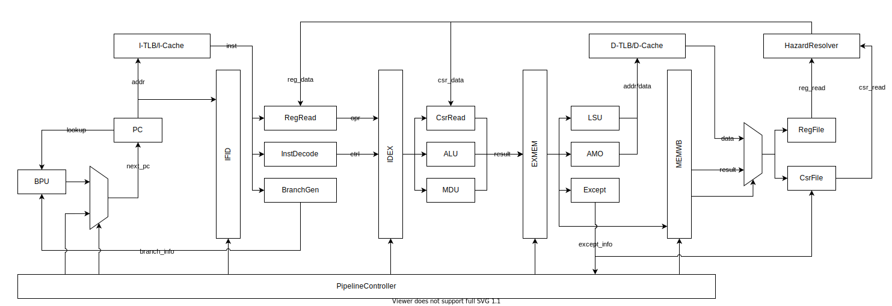

# Fuxi

[](https://github.com/MaxXSoft/Fuxi)

Fuxi (伏羲) is a 32-bit pipelined RISC-V processor written in Chisel3.



## Implemented ISAs

* RV32I 2.1
* Zifencei extension 2.0
* Zicsr extension 2.0
* M extension 2.0
* A extension 2.0
* Machine-level ISA 1.11
* Supervisor-level ISA 1.11

## Unimplemented Details

Fuxi processor is designed for running [GeeOS](https://github.com/MaxXSoft/GeeOS), or other simple operating systems or bare-metal software. Considering the complexity, the following functions has not yet been implemented:

* Memory privilege in `mstatus` register: `MPRV` bit and `MXR` bit are hardwired to 0.
* Virtualization support in `mstatus` register: `TVM` bit, `TW` bit and `TSR` bit are hardwired to 0.
* Physical Memory Protection: all PMP registers are hardwired to 0.

## Performance

With default configuration:

* **Dhrystone 2.1**: 0.60 DMIPS/MHz.
* **CoreMark**: 2.15 CoreMark/MHz.

## Getting Started

By issuing the following command lines, you can get generated verilog file in directory `verilog/build`:

```
$ git clone https://github.com/MaxXSoft/Fuxi
$ cd Fuxi
$ make
```

## Running Tests

### Running Unit Tests

All unit tests are available in directory `src/test/scala`. For example, unit test for decode stage is available in `core/DecoderTest.scala`, you can run this test by executing the following command lines:

```
$ sbt
> test:runMain core.DecoderTest
```

### Running `CoreTest`

`CoreTest` is a special unit test provided in this repository, it can run simple RISC-V programs using the Fuxi core. We also provided some programs in directory `src/test/resources`. For example, you can run one of it:

```
$ sbt
> test:runMain core.CoreTest -if src/test/resources/fib.txt
```

Trace information during running program `fib.txt` will be printed to the console.

`CoreTest` supports the following command line arguments:

| Option          | Abbreviation  | Argument              | Description
| -               | -             | -                     | -
| `--init-file`   | `-if`         | path to program file  | Specify the initialization file of ROM.
| `--trace-file`  | `-tf`         | path to trace file    | Specify the trace file, default to empty.
| `--gen-trace`   | `-gt`         | 0 or other values     | Set to 0 for trace comparison, otherwise use Fuxi core to generate trace file. Default to 0.

So you can test the core using a trace file generated by other processor or emulator:

```
> test:runMain core.CoreTest -if src/test/resources/fib.txt -tf src/test/resources/fib_trace.txt
```

For other details, please read [the source file](src/test/scala/core/CoreTest.scala) of `CoreTest.scala`.

All provided programs:

| Name        | Description
| -           | -
| fib.txt     | Generate the first 10 terms of the Fibonacci sequence.
| mdu.txt     | Perform some multiplications and divisions.
| mecall.txt  | Test machine mode environment call.
| secall.txt  | Test supervisor mode environment call.

### Running Other Test Benches

> This part is under construction.

As we see in [the top level module](src/main/scala/Fuxi.scala), the complete Fuxi processor consists of `Core` and `CoreBus`, the latter provides MMU, cache system and AXI4 interface for the `Core` part.

All of the unit test cases currently contained in this repository can only test modules in the `Core` part, we are still preparing the test bench the entire processor system. For now, you can build a tiny SoC by yourself based on some AXI4 IP cores to run other test benches you want.

## Copyright and License

Copyright (C) 2010-2020 MaxXing. License GPLv3.

Special thanks to [@Yukiteru Lee](https://github.com/wfly1998/).
